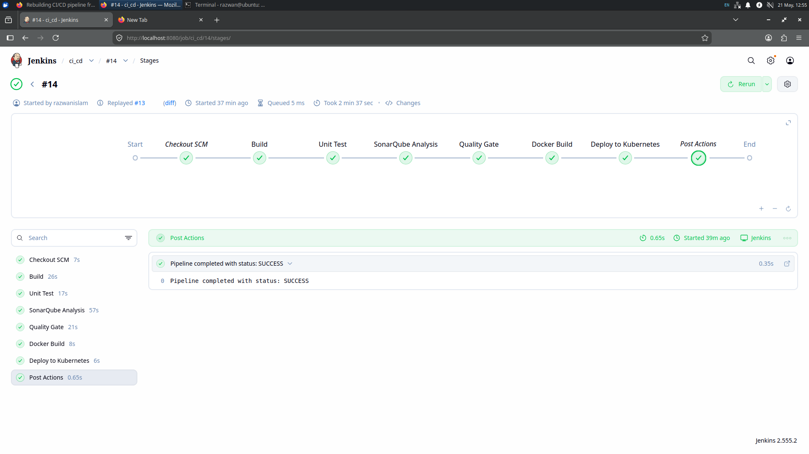
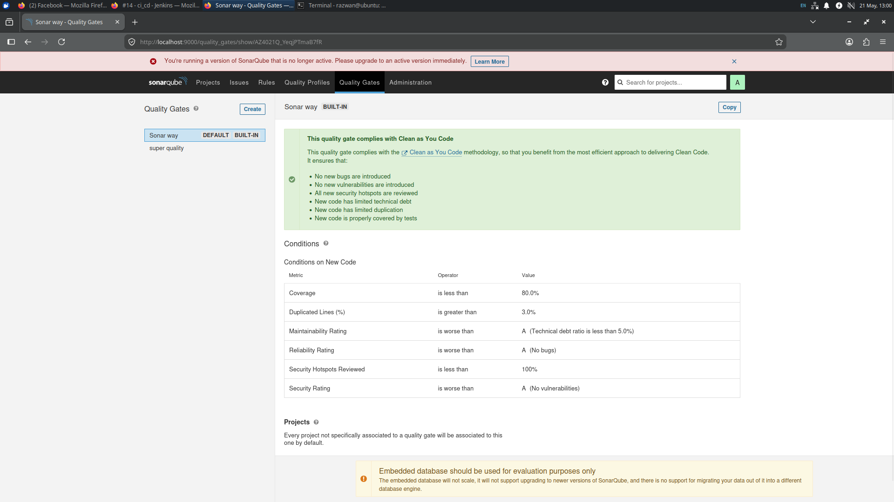
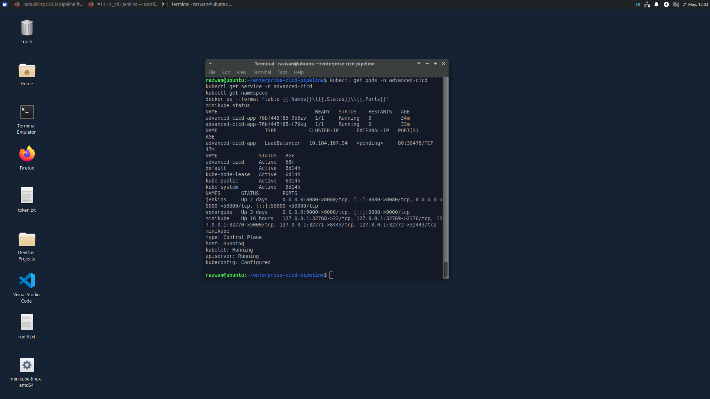
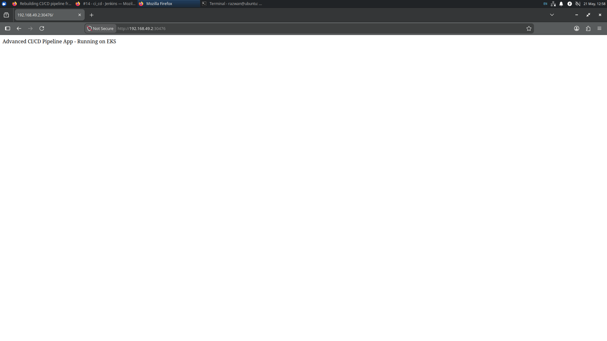

# Enterprise CI/CD Pipeline


---

## Overview

An **enterprise-grade, fully automated CI/CD pipeline** built on Ubuntu Linux that demonstrates industry-standard DevOps practices. This project showcases a complete software delivery workflow from code commit to live Kubernetes deployment, with integrated quality gates and containerization.

**Perfect for DevOps roles:** This is a real-world implementation, not a tutorial project.

---

## What This Project Does

Every time code is pushed to GitHub, the pipeline **automatically orchestrates** an 8-stage delivery workflow:

```
┌─────────────────────────────────────────────────────────────────────────┐
│                                                                         │
│  Git Push  →  Checkout  →  Build  →  Unit Tests  →  Code Quality   │
│                                                         (SonarQube)      │
│                              ↓                            ↓             │
│              Quality Gate ← Enforce ← Analysis Complete                 │
│                              ↓                                          │
│        Docker Image Build → Push to Registry → Deploy to K8s          │
│                 (Docker)      (DockerHub)      (Minikube)             │
│                                                                         │
└─────────────────────────────────────────────────────────────────────────┘
```

### Pipeline Stages (8 Total)

| # | Stage | Purpose | Tool |
|---|-------|---------|------|
| 1 | **Checkout SCM** | Pull latest code from GitHub | Git |
| 2 | **Build** | Compile Java Spring Boot application | Maven |
| 3 | **Unit Tests** | Run automated test suite | JUnit + Maven |
| 4 | **SonarQube Analysis** | Static code quality scan | SonarQube |
| 5 | **Quality Gate** | Enforce code standards (⚠️ FAILS if quality is poor) | SonarQube |
| 6 | **Docker Build** | Create container image | Docker |
| 7 | **Docker Push** | Upload to registry | DockerHub |
| 8 | **Deploy to K8s** | Live deployment on cluster | Kubectl + Minikube |

---

## Technology Stack

| Layer | Technology | Version | Purpose |
|-------|-----------|---------|---------|
| **Language** | Java | 17 (LTS) | Application runtime |
| **Framework** | Spring Boot | 3.3.5 | Web application framework |
| **Build Tool** | Maven | 3.9.4 | Dependency & build management |
| **CI/CD Orchestration** | Jenkins | Latest | Pipeline automation & orchestration |
| **Code Quality** | SonarQube | Latest | Static analysis & quality gates |
| **Containerization** | Docker | Latest | Image creation & management |
| **Container Registry** | DockerHub | — | Image storage & versioning |
| **Orchestration** | Kubernetes | Minikube | Container deployment & scaling |
| **OS** | Ubuntu Linux | 22.04 LTS | Host operating system |

---

## 🎯 Key Features

✅ **Fully Automated** — Single git push triggers entire pipeline  
✅ **Quality Gates** — Prevents low-quality code from deployment  
✅ **Container Native** — Docker + Kubernetes ready  
✅ **Production Ready** — Enterprise-grade configurations  
✅ **Local Infrastructure** — No cloud dependencies (fully portable)  
✅ **Comprehensive Logging** — Track every stage of the pipeline  
✅ **Fast Feedback** — Full pipeline execution in ~5-10 minutes  

---

## 📸 Pipeline in Action

### Jenkins Pipeline Dashboard — All Stages Green



*Jenkins displaying all 8 pipeline stages completing successfully with no failures.*

---

### SonarQube Code Quality Analysis



*Code quality metrics and analysis results from SonarQube integration, showing passed quality gates.*

---

### Kubernetes Pods Running



*Kubernetes cluster displaying the deployed application pods in Running state.*

---

### Live Application Running



*The Spring Boot application successfully running and serving requests in the browser.*

---

## 🚀 Quick Start

### Prerequisites

Ensure you have the following installed:

```bash
# Check versions
java -version              # Java 17+
mvn -version               # Maven 3.9+
docker --version           # Docker
kubectl version --client   # Kubectl
minikube version           # Minikube
```

### Local Setup

#### 1. Start Minikube

```bash
minikube start --driver=docker
```

#### 2. Connect Jenkins to Minikube Network

```bash
docker network connect minikube jenkins
```

#### 3. Create Jenkins Credentials

Log in to Jenkins UI (`http://localhost:8080`) and add:

- **DockerHub Credentials**
  - Credential ID: `dockerhub-credentials`
  - Username: Your DockerHub username
  - Password/Token: Your DockerHub access token

- **SonarQube Token**
  - Credential ID: `jinkies`
  - Token: Your SonarQube authentication token

#### 4. Configure the Jenkins Pipeline

Create a new Multibranch Pipeline job:

- **Repository URL:** `https://github.com/razwanislamrifat-source/enterprise-cicd-pipeline`
- **Branch Source:** GitHub
- **Script Path:** `Jenkinsfile`

#### 5. Trigger the Pipeline

Push code to the repository:

```bash
git add .
git commit -m "Trigger pipeline"
git push origin main
```

Monitor progress at `http://localhost:8080` (Jenkins) or:

```bash
# Watch Kubernetes deployment
kubectl get pods -w

# Check deployed service
kubectl get svc
```

---

## 📋 How It Works

### Architecture Flow

1. **Developer Push** → Code committed to GitHub
2. **Webhook Trigger** → GitHub notifies Jenkins via webhook
3. **Pipeline Execution** → Jenkins runs the Jenkinsfile
4. **Quality Check** → SonarQube validates code standards
5. **Build & Package** → Docker image created and pushed
6. **Deployment** → Kubectl deploys to Minikube cluster
7. **Feedback** → Results posted back to GitHub PR (if applicable)

### Environment Variables & Secrets

| Variable | Type | Purpose |
|----------|------|---------|
| `DOCKER_REGISTRY` | Env | DockerHub registry URL |
| `DOCKER_IMAGE` | Env | Image name (razwanff/enterprise-app) |
| `K8S_NAMESPACE` | Env | Kubernetes namespace |
| `SONAR_HOST_URL` | Env | SonarQube server URL |
| `SONAR_LOGIN` | Secret | SonarQube authentication token |

---

## 🔧 Configuration Files

- **Jenkinsfile** — Pipeline definition (8 stages)
- **Dockerfile** — Container image specification
- **pom.xml** — Maven dependencies & build configuration
- **application.properties** — Spring Boot application settings
- **k8s-deployment.yaml** — Kubernetes deployment manifest

---

## 🆘 Troubleshooting

### Issue: Jenkins Can't Connect to Docker Daemon

**Solution:**
```bash
# Ensure Docker socket is accessible
sudo usermod -aG docker jenkins
docker network connect minikube jenkins
```

### Issue: SonarQube Quality Gate Fails

**Check:**
```bash
# View SonarQube logs
docker logs sonarqube

# Access dashboard
http://localhost:9000
```

Adjust quality gate thresholds in SonarQube Project Settings if needed.

### Issue: Docker Image Push Fails

**Verify credentials:**
```bash
docker login -u razwanff
# Enter DockerHub token when prompted
```

Then re-run Jenkins build.

### Issue: Kubernetes Deployment Shows "ImagePullBackOff"

**Solution:**
```bash
# Ensure image is in DockerHub
docker images | grep razwanff

# Check image availability
kubectl describe pod <pod-name>

# Retry deployment
kubectl rollout restart deployment/<deployment-name>
```

### Issue: Port Already in Use

**Find and stop conflicting container:**
```bash
lsof -i :8080   # Jenkins
lsof -i :9000   # SonarQube
lsof -i :5000   # Docker Registry (if applicable)

# Kill process
kill -9 <PID>
```

### Issue: Maven Build Fails Locally

**Clear cache and rebuild:**
```bash
mvn clean install
# Or with offline tests
mvn clean install -DskipTests
```

---

## 📊 Performance Metrics

| Metric | Typical Value |
|--------|---------------|
| Full Pipeline Duration | 5-10 minutes |
| Build Stage | ~2 minutes |
| SonarQube Analysis | ~1 minute |
| Docker Build & Push | ~2 minutes |
| K8s Deployment | ~1 minute |
| Startup to Ready | ~30 seconds |

---

## 🎓 Learning Outcomes

This project demonstrates proficiency in:

- **CI/CD Design** — Multi-stage automated pipelines
- **Infrastructure Automation** — Jenkins, Kubernetes, Docker
- **Code Quality** — SonarQube integration & quality gates
- **Containerization** — Docker image creation & registry management
- **Container Orchestration** — Kubernetes deployments & scaling
- **Build Automation** — Maven & dependency management
- **DevOps Tools** — Industry-standard tooling
- **Java/Spring Boot** — Enterprise application development

---

## 📝 Author

**Razwan Islam**

- GitHub: [@razwanislamrifat-source](https://github.com/razwanislamrifat-source)
- Project: [enterprise-cicd-pipeline](https://github.com/razwanislamrifat-source/enterprise-cicd-pipeline)

---

## 📄 License

This project is open source and available under the MIT License.

---

**⭐ If you found this project useful, please star it!**

Access app after pipeline runs:
kubectl get pods -n advanced-cicd
minikube service advanced-cicd-app -n advanced-cicd --url

## Author

Razwan Islam — DevOps Portfolio Project
GitHub: https://github.com/razwanislamrifat-source
